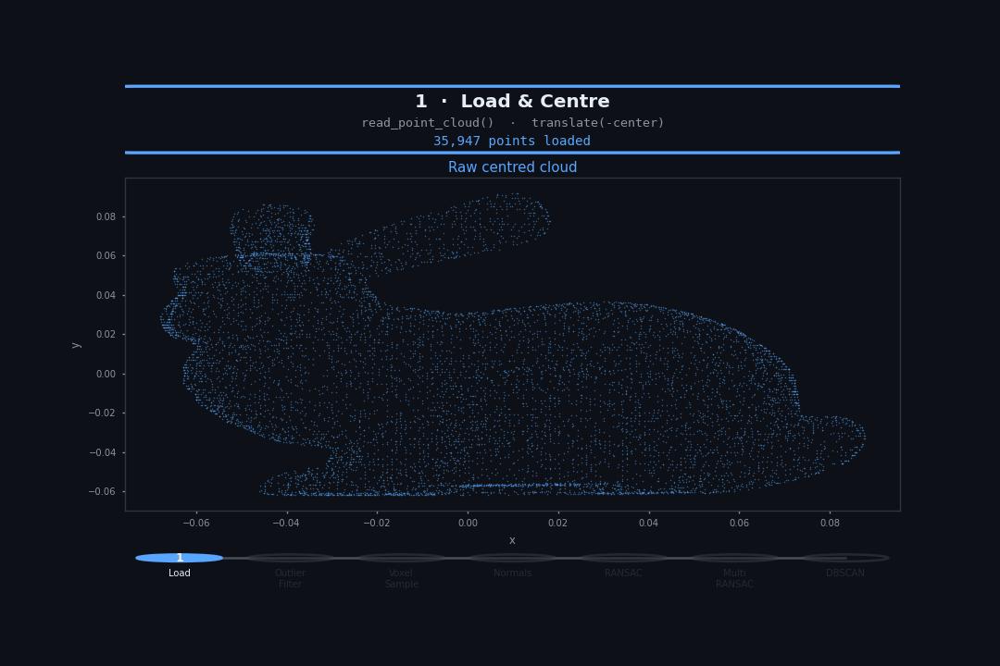

# 3D Shape Recognition Pipeline

A step-by-step point cloud processing pipeline built with **Open3D**, covering everything from raw data loading through plane segmentation and cluster extraction.


---

## Overview

| Step | Operation | Key Function |
|------|-----------|-------------|
| 1 | Load & centre | `o3d.io.read_point_cloud` |
| 2 | Outlier removal | `remove_statistical_outlier` |
| 3 | Voxel downsampling | `voxel_down_sample` |
| 4 | Normal estimation | `estimate_normals` |
| 5 | RANSAC plane segmentation | `segment_plane` |
| 6 | Multi-order RANSAC | iterative `segment_plane` |
| 7 | DBSCAN clustering | `cluster_dbscan` |

---

## Requirements

```bash
pip install open3d numpy matplotlib laspy
```

Tested with Python 3.10, Open3D 0.17+.

---

## Data

Place your point cloud file at:

```
../Data/bunny.ply
```

Any `.ply`, `.pcd`, or `.las` file works — just update `data_path` in the first cell.

---

## Pipeline Details

### 1 · Load & Centre

```python
pcd = o3d.io.read_point_cloud(data_path)
pcd.translate(-pcd.get_center())
```

Centres the cloud on the origin so all subsequent distance thresholds are scene-independent.

---

### 2 · Statistical Outlier Removal

```python
filtered_pcd, ind = pcd.remove_statistical_outlier(nb_neighbors=16, std_ratio=10)
```

For every point, computes the mean distance to its 16 nearest neighbours. Points further than `mean + 10×std` from the global distribution are flagged as outliers and removed. Painted red for inspection before removal.

| Parameter | Effect |
|-----------|--------|
| `nb_neighbors` | Larger neighbourhood → smoother threshold |
| `std_ratio` | Lower value → more aggressive removal |

---

### 3 · Voxel Downsampling

```python
pcd_downsampled = filtered_pcd.voxel_down_sample(voxel_size=0.001)
```

Divides space into a regular grid of `voxel_size`-sided cubes and keeps one representative point per cell. Reduces point count while preserving shape, and makes all downstream steps faster and more uniform.

---

### 4 · Normal Estimation

```python
nn_distance = np.mean(pcd_downsampled.compute_nearest_neighbor_distance())
radius_normal = nn_distance * 5

pcd_downsampled.estimate_normals(
    search_param=o3d.geometry.KDTreeSearchParamHybrid(radius=radius_normal, max_nn=16),
    fast_normal_computation=True
)
```

Fits a local plane to each point's neighbourhood (hybrid KD-tree: at most 16 neighbours within `radius`). The normals are used implicitly by RANSAC's inlier scoring.

---

### 5 · RANSAC Plane Segmentation

```python
plane_model, inliers = pcd_downsampled.segment_plane(
    distance_threshold=0.01,
    ransac_n=3,
    num_iterations=1000
)
```

Randomly samples 3 points, fits a plane `ax + by + cz + d = 0`, counts how many points fall within `distance_threshold`. Repeats for `num_iterations` trials and keeps the best model.

---

### 6 · Multi-Order RANSAC

Runs RANSAC iteratively, stripping each found plane before searching for the next. Stops when fewer than `min_inliers` points support the best candidate plane.

---

### 7 · DBSCAN Clustering

Density-based clustering on the non-planar remainder. Groups points that are within `eps` of at least `min_points` neighbours. Points that don't belong to any dense region receive label `-1` (noise) and are painted black.

## Gifs



