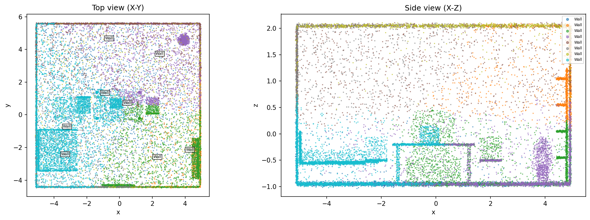
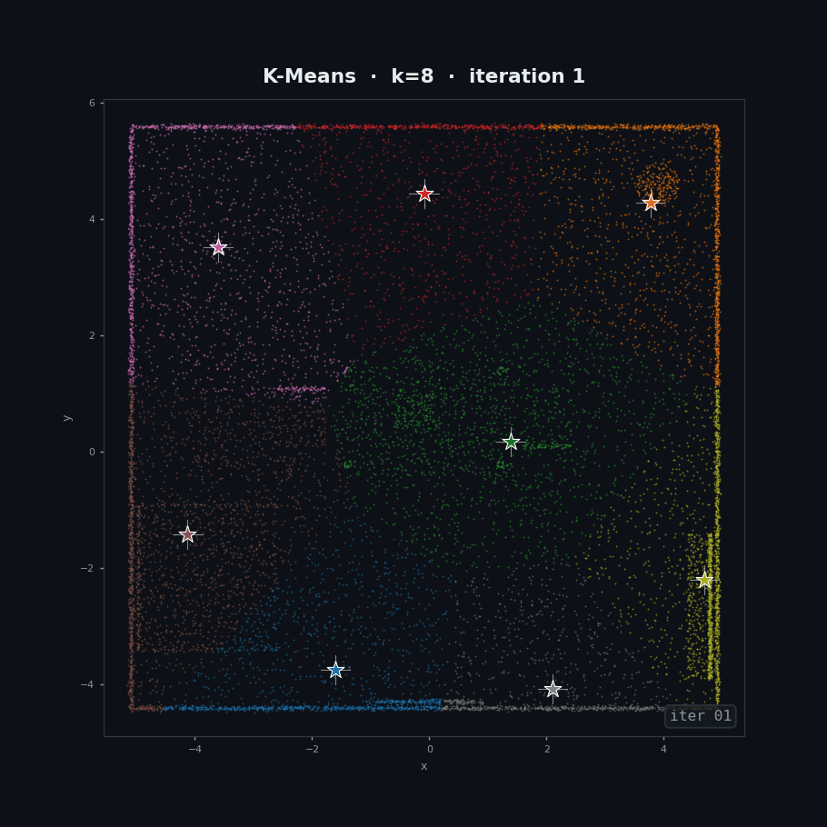

# K-Means Point Cloud Segmentation

A full point cloud segmentation pipeline applied to a synthetic indoor scene, using K-Means clustering with feature engineering and automatic segment labelling.


---

## Overview

| Step | Operation | Key Function |
|------|-----------|-------------|
| 1 | Load & centre | `o3d.io.read_point_cloud(format='xyz')` |
| 2 | Voxel downsampling | `voxel_down_sample` |
| 3 | Feature extraction | XYZ + normalised height + local density |
| 4 | Elbow + Silhouette | `MiniBatchKMeans` sweep over k=2…11 |
| 5 | K-Means clustering | `KMeans(n_clusters=8)` |
| 6 | Bounding boxes | `get_axis_aligned_bounding_box` per cluster |
| 7 | Segment labelling | Rule-based from z_mean, z_range, point count |
| 8 | 2-D visualisation | Top view (X-Y) + Side view (X-Z) |

---

## Requirements

```bash
pip install open3d numpy matplotlib scikit-learn
```

---

## Data

The included `indoor_scene.xyz` is a synthetic 22,100-point indoor room containing:

- Floor and ceiling planes
- 4 walls
- Dining table + 2 chairs
- Sofa + armrests
- Bookshelf
- TV + TV stand
- Coffee table
- Plant (pot + foliage sphere)
- Box object on table

The file has no header — columns are simply `x y z` (space-separated floats). Place it at:

```
../Data/indoor_scene.xyz
```

---

## Pipeline Details

### 1 · Load & Centre

```python
pcd = o3d.io.read_point_cloud(data_path, format='xyz')
pcd.translate(-pcd.get_center())
```

---

### 2 · Voxel Downsampling

```python
pcd_down = pcd.voxel_down_sample(voxel_size=0.05)
```

Reduces the 22k-point cloud to ~16k uniform points. A larger `voxel_size` speeds up KMeans but loses fine detail on small objects.

---

### 3 · Feature Extraction

Raw XYZ alone gives poor KMeans results because it treats all axes equally and ignores local structure. Adding two extra features improves cluster separation significantly:

```python
z_norm   = (pts[:,2] - pts[:,2].min()) / (pts[:,2].max() - pts[:,2].min())
nn_dists = np.array(pcd_down.compute_nearest_neighbor_distance())
features = np.column_stack([pts, z_norm, nn_dists])
features_scaled = StandardScaler().fit_transform(features)
```

| Feature | What it encodes |
|---------|----------------|
| `x, y, z` | Spatial position |
| `z_norm` | Height above floor (0=floor, 1=ceiling) |
| `nn_distance` | Local point density — walls/floor are denser than furniture edges |

`StandardScaler` ensures no single feature dominates the Euclidean distance.

---

### 4 · Elbow Method + Silhouette Analysis

Pick `k` where the inertia curve bends (elbow) **and** the silhouette score peaks. For this scene, k=8 balances both.

| Metric | Higher is | Ideal value |
|--------|-----------|-------------|
| Inertia | worse | as low as possible without over-clustering |
| Silhouette | better | > 0.3 indicates clear cluster separation |

---

### 5 · K-Means Clustering

`n_init=20` runs 20 random initialisations and keeps the best — important for avoiding local minima with spatial data.

---

### 6 · Bounding Boxes

Axis-aligned bounding boxes give a quick spatial summary of each cluster's extent — useful for downstream tasks like object detection or collision avoidance.


### 7 · Automatic Segment Labelling

Rule-based labelling from cluster statistics:

```python
if   z_mean < -0.8 and z_range < 0.2:   label = "Floor"
elif z_mean >  1.1 and z_range < 0.25:  label = "Ceiling"
elif z_range > 1.8 and n_pts   > 300:   label = "Wall"
elif 0.1 < z_mean < 0.5:                label = "Furniture (low)"
elif 0.5 < z_mean < 1.0:                label = "Furniture (mid)"
else:                                    label = "Object"
```

Thresholds assume the cloud is centred at origin. Adjust if your scene has a different scale.

---


## Results

